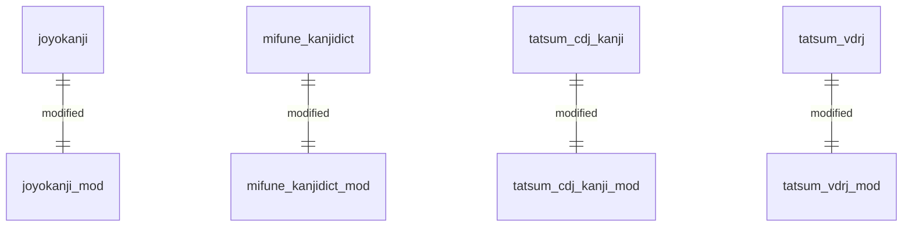

# DB設計
## appdata_db

```mermaid
erDiagram
  joyokanji ||--|| joyokanji_mod : modified
  mifune_kanjidict ||--|| mifune_kanjidict_mod : modified
  tatsum_cdj_kanji ||--|| tatsum_cdj_kanji_mod : modified
  tatsum_vdrj ||--|| tatsum_vdrj_mod : modified
```

## userdata_db
```mermaid
```