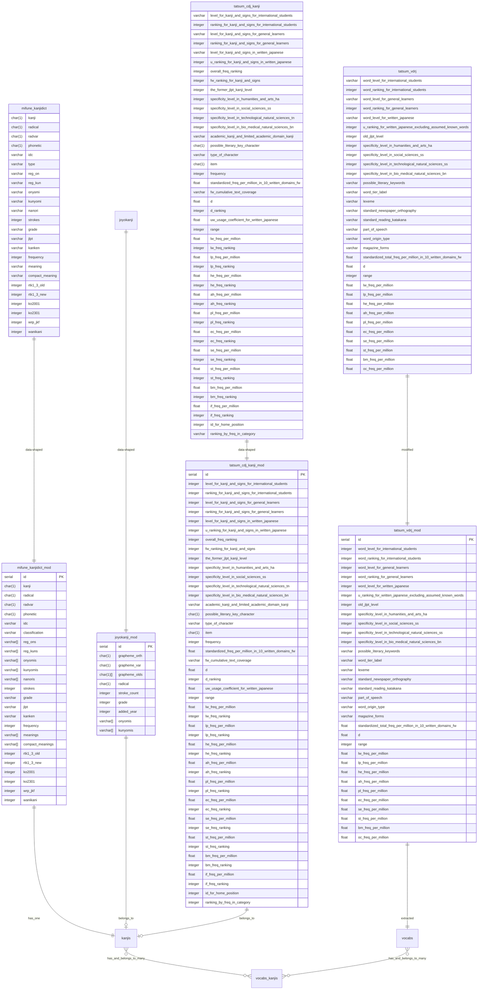

# DB設計
*This design is from the planning phase. It is subject to change.*
## appdata_db

```mermaid
erDiagram
  joyokanji ||--|| joyokanji_mod : data-shaped
  mifune_kanjidict ||--|| mifune_kanjidict_mod : data-shaped
  tatsum_cdj_kanji ||--|| tatsum_cdj_kanji_mod : data-shaped
  tatsum_vdrj ||--|| tatsum_vdrj_mod : modified
  mifune_kanjidict_mod ||--|| kanjis : has_one
  joyokanji_mod ||--o| kanjis : belongs_to
  tatsum_cdj_kanji_mod ||--o| kanjis : belongs_to
  tatsum_vdrj_mod ||--|| vocabs : extracted
  kanjis }o--o{ vocabs_kanjis : has_and_belongs_to_many
  vocabs }o--o{ vocabs_kanjis : has_and_belongs_to_many

  joyokanji_mod {
    serial id PK
    char(1) grapheme_orth
    char(1) grapheme_var
    char(1)[] grapheme_olds
    char(1) radical
    integer stroke_count
    integer grade
    integer added_year
    varchar[] onyomis
    varchar[] kunyomis
  }

  mifune_kanjidict {
    char(1) kanji
    char(1) radical
    char(1) radvar
    char(1) phonetic
    varchar idc
    varchar type
    varchar reg_on
    varchar reg_kun
    varchar onyomi
    varchar kunyomi
    varchar nanori
    integer strokes
    varchar grade
    varchar jlpt
    varchar kanken
    integer frequency
    varchar meaning
    varchar compact_meaning
    integer rtk1_3_old
    integer rtk1_3_new
    integer ko2001
    integer ko2301
    integer wrp_jkf
    integer wanikani
  }

  mifune_kanjidict_mod {
    serial id PK
    char(1) kanji
    char(1) radical
    char(1) radvar
    char(1) phonetic
    varchar idc
    varchar classification
    varchar[] reg_ons
    varchar[] reg_kuns
    varchar[] onyomis
    varchar[] kunyomis
    varchar[] nanoris
    integer strokes
    varchar grade
    varchar jlpt
    varchar kanken
    integer frequency
    varchar[] meanings
    varchar[] compact_meanings
    integer rtk1_3_old
    integer rtk1_3_new
    integer ko2001
    integer ko2301
    integer wrp_jkf
    integer wanikani
  }

  tatsum_cdj_kanji {
    varchar level_for_kanji_and_signs_for_international_students
    integer ranking_for_kanji_and_signs_for_international_students
    varchar level_for_kanji_and_signs_for_general_learners
    integer ranking_for_kanji_and_signs_for_general_learners
    varchar level_for_kanji_and_signs_in_written_japanese
    integer u_ranking_for_kanji_and_signs_in_written_japanese
    integer overall_freq_ranking
    integer fw_ranking_for_kanji_and_signs
    integer the_former_jlpt_kanji_level
    integer specificity_level_in_humanities_and_arts_ha
    integer specificity_level_in_social_sciences_ss
    integer specificity_level_in_technological_natural_sciences_tn
    integer specificity_level_in_bio_medical_natural_sciences_bn
    varchar academic_kanji_and_limited_academic_domain_kanji
    char(1) possible_literary_key_character
    varchar type_of_character
    char(1) item
    integer frequency
    float standardized_freq_per_million_in_10_written_domains_fw
    varchar fw_cumulative_text_coverage
    float d
    integer d_ranking
    float uw_usage_coefficient_for_written_japanese
    integer range
    float lw_freq_per_million
    integer lw_freq_ranking
    float lp_freq_per_million
    integer lp_freq_ranking
    float he_freq_per_million
    integer he_freq_ranking
    float ah_freq_per_million
    integer ah_freq_ranking
    float pl_freq_per_million
    integer pl_freq_ranking
    float ec_freq_per_million
    integer ec_freq_ranking
    float se_freq_per_million
    integer se_freq_ranking
    float st_freq_per_million
    integer st_freq_ranking
    float bm_freq_per_million
    integer bm_freq_ranking
    float if_freq_per_million
    integer if_freq_ranking
    integer id_for_home_position
    varchar ranking_by_freq_in_category
  }

  tatsum_cdj_kanji_mod {
    serial id PK
    integer level_for_kanji_and_signs_for_international_students
    integer ranking_for_kanji_and_signs_for_international_students
    integer level_for_kanji_and_signs_for_general_learners
    integer ranking_for_kanji_and_signs_for_general_learners
    integer level_for_kanji_and_signs_in_written_japanese
    integer u_ranking_for_kanji_and_signs_in_written_japanese
    integer overall_freq_ranking
    integer fw_ranking_for_kanji_and_signs
    integer the_former_jlpt_kanji_level
    integer specificity_level_in_humanities_and_arts_ha
    integer specificity_level_in_social_sciences_ss
    integer specificity_level_in_technological_natural_sciences_tn
    integer specificity_level_in_bio_medical_natural_sciences_bn
    varchar academic_kanji_and_limited_academic_domain_kanji
    char(1) possible_literary_key_character
    varchar type_of_character
    char(1) item
    integer frequency
    float standardized_freq_per_million_in_10_written_domains_fw
    varchar fw_cumulative_text_coverage
    float d
    integer d_ranking
    float uw_usage_coefficient_for_written_japanese
    integer range
    float lw_freq_per_million
    integer lw_freq_ranking
    float lp_freq_per_million
    integer lp_freq_ranking
    float he_freq_per_million
    integer he_freq_ranking
    float ah_freq_per_million
    integer ah_freq_ranking
    float pl_freq_per_million
    integer pl_freq_ranking
    float ec_freq_per_million
    integer ec_freq_ranking
    float se_freq_per_million
    integer se_freq_ranking
    float st_freq_per_million
    integer st_freq_ranking
    float bm_freq_per_million
    integer bm_freq_ranking
    float if_freq_per_million
    integer if_freq_ranking
    integer id_for_home_position
    integer ranking_by_freq_in_category
  }

  tatsum_vdrj {
    varchar word_level_for_international_students
    integer word_ranking_for_international_students
    varchar word_level_for_general_learners
    integer word_ranking_for_general_learners
    varchar word_level_for_written_japanese
    integer u_ranking_for_written_japanese_excluding_assumed_known_words
    integer old_jlpt_level
    integer specificity_level_in_humanities_and_arts_ha
    integer specificity_level_in_social_sciences_ss
    integer specificity_level_in_technological_natural_sciences_ss
    integer specificity_level_in_bio_medical_natural_sciences_bn
    varchar possible_literary_keywords
    varchar word_tier_label
    varchar lexeme
    varchar standard_newspaper_orthography
    varchar standard_reading_katakana
    varchar part_of_speech
    varchar word_origin_type
    varchar magazine_forms
    float standardized_total_freq_per_million_in_10_written_domains_fw
    float d
    integer range
    float lw_freq_per_million
    float lp_freq_per_million
    float he_freq_per_million
    float ah_freq_per_million
    float pl_freq_per_million
    float ec_freq_per_million
    float se_freq_per_million
    float st_freq_per_million
    float bm_freq_per_million
    float oc_freq_per_million
  }

  tatsum_vdrj_mod {
    serial id PK
    integer word_level_for_international_students
    integer word_ranking_for_international_students
    integer word_level_for_general_learners
    integer word_ranking_for_general_learners
    integer word_level_for_written_japanese
    integer u_ranking_for_written_japanese_excluding_assumed_known_words
    integer old_jlpt_level
    integer specificity_level_in_humanities_and_arts_ha
    integer specificity_level_in_social_sciences_ss
    integer specificity_level_in_technological_natural_sciences_ss
    integer specificity_level_in_bio_medical_natural_sciences_bn
    varchar possible_literary_keywords
    varchar word_tier_label
    varchar lexeme
    varchar standard_newspaper_orthography
    varchar standard_reading_katakana
    varchar part_of_speech
    varchar word_origin_type
    varchar magazine_forms
    float standardized_total_freq_per_million_in_10_written_domains_fw
    float d
    integer range
    float lw_freq_per_million
    float lp_freq_per_million
    float he_freq_per_million
    float ah_freq_per_million
    float pl_freq_per_million
    float ec_freq_per_million
    float se_freq_per_million
    float st_freq_per_million
    float bm_freq_per_million
    float oc_freq_per_million
  }
```