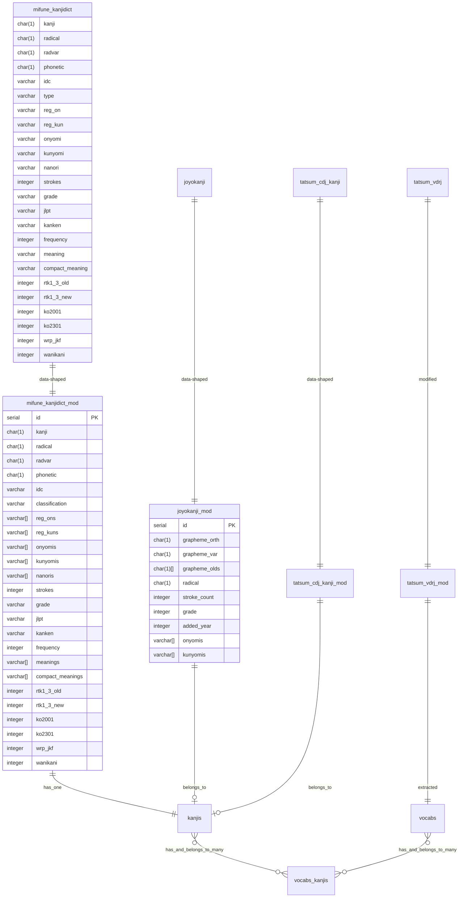

# DB設計
## appdata_db

```mermaid
erDiagram
  joyokanji ||--|| joyokanji_mod : data-shaped
  mifune_kanjidict ||--|| mifune_kanjidict_mod : data-shaped
  tatsum_cdj_kanji ||--|| tatsum_cdj_kanji_mod : data-shaped
  tatsum_vdrj ||--|| tatsum_vdrj_mod : modified
  mifune_kanjidict_mod ||--|| kanjis : has_one
  joyokanji_mod ||--o| kanjis : belongs_to
  tatsum_cdj_kanji_mod ||--o| kanjis : belongs_to
  tatsum_vdrj_mod ||--|| vocabs : extracted
  kanjis }o--o{ vocabs_kanjis : has_and_belongs_to_many
  vocabs }o--o{ vocabs_kanjis : has_and_belongs_to_many

  joyokanji_mod {
    serial id PK
    char(1) grapheme_orth
    char(1) grapheme_var
    char(1)[] grapheme_olds
    char(1) radical
    integer stroke_count
    integer grade
    integer added_year
    varchar[] onyomis
    varchar[] kunyomis
  }

  mifune_kanjidict {
    char(1) kanji
    char(1) radical
    char(1) radvar
    char(1) phonetic
    varchar idc
    varchar type
    varchar reg_on
    varchar reg_kun
    varchar onyomi
    varchar kunyomi
    varchar nanori
    integer strokes
    varchar grade
    varchar jlpt
    varchar kanken
    integer frequency
    varchar meaning
    varchar compact_meaning
    integer rtk1_3_old
    integer rtk1_3_new
    integer ko2001
    integer ko2301
    integer wrp_jkf
    integer wanikani
  }

  mifune_kanjidict_mod {
    serial id PK
    char(1) kanji
    char(1) radical
    char(1) radvar
    char(1) phonetic
    varchar idc
    varchar classification
    varchar[] reg_ons
    varchar[] reg_kuns
    varchar[] onyomis
    varchar[] kunyomis
    varchar[] nanoris
    integer strokes
    varchar grade
    varchar jlpt
    varchar kanken
    integer frequency
    varchar[] meanings
    varchar[] compact_meanings
    integer rtk1_3_old
    integer rtk1_3_new
    integer ko2001
    integer ko2301
    integer wrp_jkf
    integer wanikani
  }
```