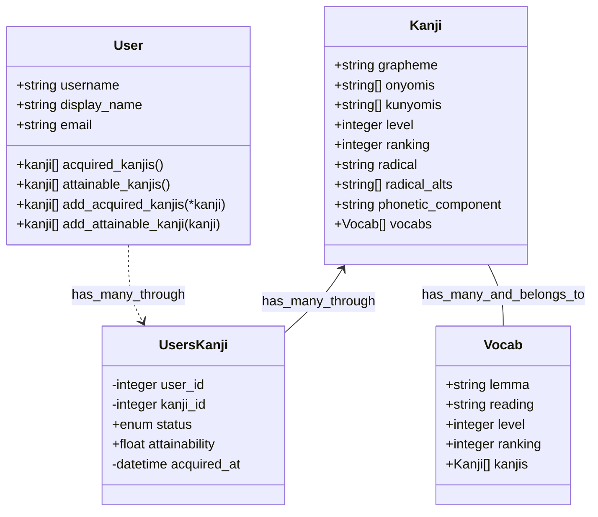

```mermaid
classDiagram
  class User {
    +string username
    +string display_name
    +string email
    +kanji[] acquired_kanjis()
    +kanji[] attainable_kanjis()
    +kanji[] add_acquired_kanjis(*kanji)
    +kanji[] add_attainable_kanji(kanji)
  }

  class UsersKanji {
    -integer user_id
    -integer kanji_id
    +enum status
    +float attainability
    -datetime acquired_at
  }

  class Kanji {
    +string grapheme
    +string[] onyomis
    +string[] kunyomis
    +integer level
    +integer ranking
    +string radical
    +string[] radical_alts
    +string phonetic_component
    +Vocab[] vocabs
  }

  class Vocab {
    +string lemma
    +string reading
    +integer level
    +integer ranking
    +Kanji[] kanjis
  }
  User ..> UsersKanji : has_many_through
  Kanji <-- UsersKanji : has_many_through
  Kanji -- Vocab : has_many_and_belongs_to
```